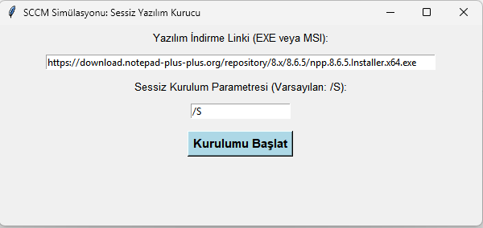
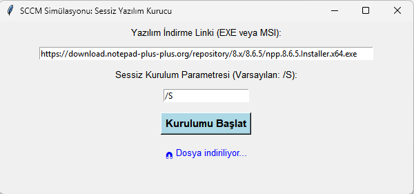
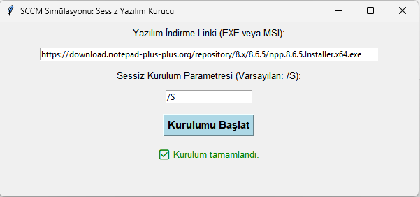

# 🛠️ SCCM Simülasyonu: Sessiz Yazılım Kurucu

Bu proje, Microsoft SCCM benzeri basit bir GUI üzerinden `.exe` veya `.msi` uzantılı yazılım paketlerini **sessiz kurulum** parametresiyle indirip yükleyen bir simülasyon uygulamasıdır.

## 🚀 Özellikler

- Yazılım URL'sini girerek indirir (örneğin Notepad++, 7-Zip vs.)
- Sessiz kurulum parametresi ile yükleme yapar (varsayılan: `/S`)
- İndirilen dosyayı otomatik çalıştırır
- Kurulum sürecini ekranda gösterir
- Tüm olayları `kurulum_log.txt` dosyasına kaydeder
- Basit ve kullanıcı dostu bir Tkinter arayüzü sunar

## 🧪 Kullanım

1. Kodları indir
2. Python dosyasını çalıştır: `sessiz_kurucu.py`
3. Yazılım bağlantısını ve (opsiyonel) kurulum parametresini gir
4. “Kurulumu Başlat” butonuna tıkla
5. Kurulum ilerlemesini ekrandan ve log dosyasından takip et

## ⚠️ Notlar

- Bazı yazılımlar sistem dosyalarına yazdığı için **yönetici izni gerektirebilir** (`WinError 740`)
- Uygulama `.exe` haline getirilip yönetici yetkisiyle çalıştırılabilir

## 📁 Örnek Yazılım Bağlantıları

- Notepad++:  
  `https://download.notepad-plus-plus.org/repository/8.x/8.6.5/npp.8.6.5.Installer.x64.exe`

